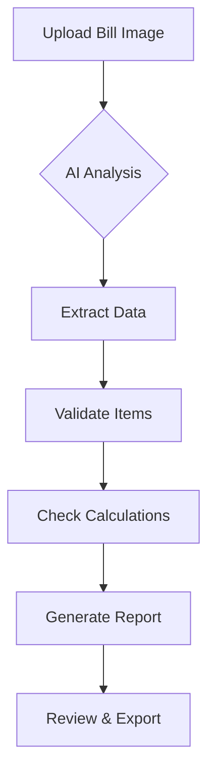
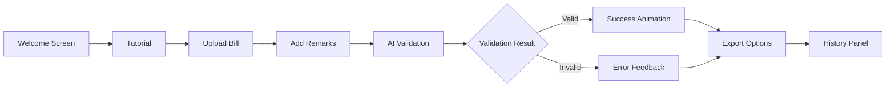

# AI Stationery Bill Validator

An intelligent web application that validates stationary bills using Google's Gemini AI. This tool helps organizations verify stationary purchases by analyzing bill images, checking item eligibility, and validating calculations.

## 🌟 Key Features

- **🤖 AI-Powered Bill Analysis**: Uses Google Gemini AI to extract and analyze bill information
- **✅ Smart Validation**: Automatically checks if items are eligible for reimbursement
- **🧮 Calculation Verification**: Validates totals match item sums within tolerance
- **📋 Comprehensive Data Extraction**: Extracts bill details including numbers, dates, and shop info
- **📤 Multiple Export Options**: Export results as JSON, CSV, or printable reports
- **📝 User Remarks**: Add custom remarks for context and documentation
- **🎨 New Modern Theme**: Fresh blue and pink color scheme for a professional look
- **⌨️ Keyboard Shortcuts**: Efficient navigation with keyboard controls
- **📱 Responsive Design**: Works on desktop and mobile devices
- **🎉 Animated UI**: Smooth animations and transitions for better user experience

## 🚀 How It Works

1. **Upload**: Drag and drop or click to upload a clear image of a stationary bill
2. **Remark**: Add custom remarks about the validation for documentation
3. **Validate**: AI analyzes the bill and checks item eligibility and calculations
4. **Review**: View detailed analysis including item validation, calculation checks, and recommendations
5. **Export**: Download results in JSON, CSV, or printable format

## 📋 Supported Items

The validator recognizes common stationary and printing items including:

Click to expand list

- Pens, Pencils, Markers, Highlighters
- Notebooks, Registers, Files, Folders
- Paper (A4, A3, Card Sheets)
- Ink, Toner Cartridges
- Staplers, Pins, Clips, Tape, Glue
- Erasers, Sharpeners, Correction Fluid
- Calculators
- Cups, Bottles, Jugs, Flasks
- Business Cards, Letterheads, Posters
- Invitations, Greeting Cards, Calendars
- Certificates, Brochures, Flyers
- Printing Services (Xerox, Photocopy, Binding, Lamination)
- P.out services

## ⌨️ Keyboard Shortcuts

| Shortcut | Action |
|----------|--------|
| `Ctrl+V` | Paste image from clipboard |
| `Ctrl+Enter` | Validate bill (after adding remarks) |
| `Escape` | Clear current bill |
| `H` | Show tutorial |

## 🎨 UI Animations & Visual Enhancements

### Loading Animations
- **Progress Bar**: Smooth animated progress bar during AI processing
- **Spinner**: Elegant loading spinner while encoding images
- **Pulse Effects**: Subtle pulse animations on interactive elements

### Transition Animations
- **Fade Effects**: Smooth fade-in for validation results and error messages
- **Hover Effects**: Subtle scaling and shadow effects on buttons and cards
- **Slide Transitions**: Smooth sliding animations for panels and sections

### Visual Feedback
- **Confetti Celebration**: Animated confetti for successful validations
- **Status Indicators**: Color-coded badges with animated state changes
- **Thumbnail Previews**: Smooth image loading with shimmer effects

### Interactive Elements
- **Button Animations**: Gradient shine effects on primary buttons
- **Card Hover**: Subtle lift effect when hovering over cards
- **Form Interactions**: Smooth focus states for input fields

### New Theme
- **Color Scheme**: Fresh blue and pink theme with `#E2F0F9`, `#B0DDE4`, `#286FB4`, `#FFFFFF`, and `#DF4C73`
- **Modern Design**: Clean, professional look with consistent color application
- **Enhanced Visual Hierarchy**: Improved contrast and readability

## 📥 Installation

1. Clone or download this repository
2. Open `index.html` in a web browser
3. Start validating bills!

## 📖 Usage

1. Open the application in your web browser
2. Click "Drag & drop or click to upload" or paste an image with `Ctrl+V`
3. Add any relevant remarks in the remarks section
4. Click "Save Remarks & Validate Bill"
5. Review the validation results and export if needed

## 📤 Export Options

- **📋 Copy JSON**: Copy raw validation results to clipboard
- **📊 Export CSV**: Download detailed validation report as CSV
- **🖨️ Print**: Generate a printable report with all validation details
- **💾 Download JSON**: Save validation results and remarks as JSON file

## 🛠️ Technical Details

- **Frontend**: HTML, CSS, JavaScript
- **AI Engine**: Google Gemini API
- **Model**: gemini-2.5-flash
- **No Backend Required**: Runs entirely in the browser
- **Data Privacy**: All processing happens client-side

## 🎯 User Experience Flow

## 👨‍💻 Made by

Made by Team NBI

## 📄 License

This project is for internal use only.
